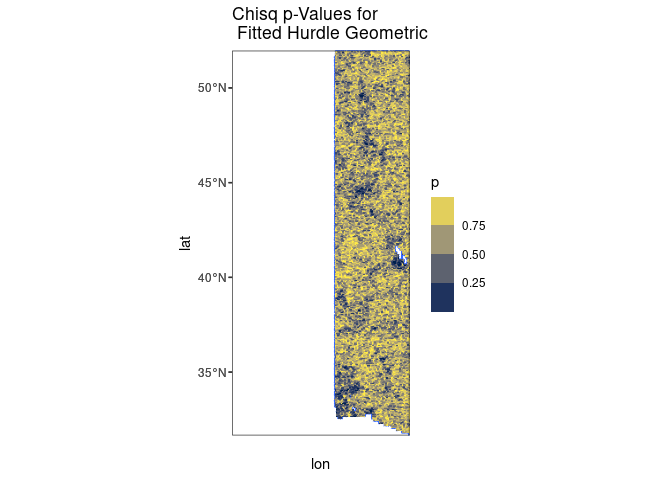
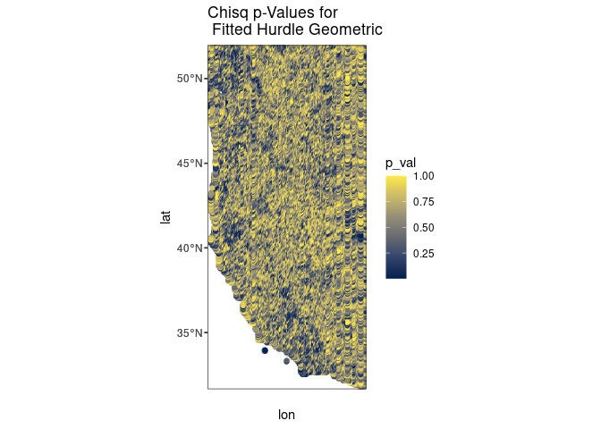

GTETLG Goodness of Fit on Livneh (Unsplit) Precipitation
================
alexander
2022-07-08

First, the setup (boring)

``` r
# Load packages -----------------------------------------------------------
library(tidyverse)
library(rnaturalearth)
library(rnaturalearthdata)
library(metR)
library(sf)
#library(fasano.franceschini.test)

# Load auxiliary functions ------------------------------------------------
source("./gtetlg_utils.R")


# Load files --------------------------------------------------------------
complete_prec_events_df <- read_csv("./data/livneh_unsplit/complete_prec_events.csv")
```

    ## Rows: 78794968 Columns: 9
    ## ── Column specification ───────────────────────────────────────────────────────────────────────────────
    ## Delimiter: ","
    ## chr (1): unique_id
    ## dbl (8): event_var_threshold, total, max_rate, length, event_number, lon, lat, time
    ## 
    ## ℹ Use `spec()` to retrieve the full column specification for this data.
    ## ℹ Specify the column types or set `show_col_types = FALSE` to quiet this message.

``` r
# prec_event_parameters_df <- read_csv("./data/prec_event_parameters.csv") %>%
#   rename(n = n_events,
#          q = q_hat,
#          p = p_hat,
#          b = b_hat)


# Generate precip events from estimated parameters ------------------------
# generated_prec_events_df <- apply(X = prec_event_parameters_df,
#                                   FUN = function(row) {
#                                     #print(row)
#                                     #print(row[2] %>% as.numeric())
#                                     do.call(Map,
#                                             c(f = rgtetlg,
#                                               row[-(1:4)] %>% as.numeric())
#                                     )[[1]] %>%
#                                       mutate(unique_id = row[1],
#                                              lat = row[2] %>% as.numeric(),
#                                              lon = row[3] %>% as.numeric())
#                                     #print(row)
#                                   },
#                                   MARGIN = 1) %>% bind_rows()

# write_csv(x = generated_prec_events_df,
#           file = "./data/livneh_unsplit/generated_prec_events.csv")

# Declare constants -------------------------------------------------------
world <- ne_countries(returnclass = "sf")
lon_min <- complete_prec_events_df$lon %>% min()
lon_max<- complete_prec_events_df$lon %>% max()
lat_min <- complete_prec_events_df$lat %>% min()
lat_max <- complete_prec_events_df$lat %>% max()
```

*Event Length Hurdle Geometric Goodness-of-Fit*

``` r
chisq_n_df <- read_csv("./data/chisq_n.csv", col_names = FALSE) %>%
  rename('p_val' = 'X1', 'unique_id' = 'X2') %>%
  separate(col = unique_id,
           into = c("lon", "lat"),
           sep = "_",
           convert= TRUE)
```

    ## Rows: 27000 Columns: 2
    ## ── Column specification ───────────────────────────────────────────────────────────────────────────────
    ## Delimiter: ","
    ## chr (1): X2
    ## dbl (1): X1
    ## 
    ## ℹ Use `spec()` to retrieve the full column specification for this data.
    ## ℹ Specify the column types or set `show_col_types = FALSE` to quiet this message.

``` r
ggplot(data = world) +
  geom_contour(data = chisq_n_df %>%
                 na.omit(),
               aes(x = lon,
                   y = lat,
                   z = p_val)) +
  geom_contour_fill(data = chisq_n_df %>%
                      na.omit(),
                    aes(x = lon,
                        y = lat,
                        z = p_val)) +
  # geom_tile(data = chisq_n_df %>%
  #             na.omit(),
  #           aes(x = lon,
  #               y = lat,
  #               colour = p_val)) +
  scale_fill_viridis_c(option = "cividis") +
  #scale_color_viridis_c(option = "cividis") +
  geom_sf(fill = NA) +
  coord_sf(xlim = c(lon_min, lon_max),
           ylim = c(lat_min, lat_max),
           #ylim = c(26, lat_max),
           expand = FALSE) +
  guides(fill = guide_colorsteps(title = paste0("p"))) +
  labs(title = "Chisq p-Values for\n Fitted Hurdle Geometric") +
  theme_bw()
```

<!-- -->

``` r
ggplot(data = world) +
  # geom_contour(data = chisq_n_df %>%
  #                na.omit(),
  #              aes(x = lon,
  #                  y = lat,
  #                  z = p_val)) +
  # geom_contour_fill(data = chisq_n_df %>%
  #                     na.omit(),
  #                   aes(x = lon,
  #                       y = lat,
  #                       z = p_val)) +
  geom_tile(data = chisq_n_df %>%
              na.omit(),
            aes(x = lon,
                y = lat,
                colour = p_val)) +
  #scale_fill_viridis_c(option = "cividis") +
  scale_color_viridis_c(option = "cividis") +
  geom_sf(fill = NA) +
  coord_sf(xlim = c(lon_min, lon_max),
           ylim = c(lat_min, lat_max),
           #ylim = c(26, lat_max),
           expand = FALSE) +
  guides(fill = guide_colorsteps(title = paste0("p"))) +
  labs(title = "Chisq p-Values for\n Fitted Hurdle Geometric") +
  theme_bw()
```

<!-- -->

``` r
# To be placed in overnight scripts ---------------------------------------
# generated_prec_events_df <- read_csv("./data/livneh_unsplit/generated_prec_events.csv") %>%
#   rename(length = event_length)
# 
# unique_id_v <- complete_prec_events_df$unique_id %>% unique()
# 
# start_time <- Sys.time()
# multivariate_fasano_xyn_df <- lapply(X = unique_id_v[1:3],
#                                   FUN = function(id) {
#                                     fasano.franceschini.test(S1 = complete_prec_events_df %>%
#                                                                filter(unique_id == id) %>%
#                                                                select(length, total, max_rate) %>%
#                                                                as.matrix(),
#                                                              S2 = generated_prec_events_df %>%
#                                                                filter(unique_id == id) %>%
#                                                                select(event_length, event_magnitude, event_max) %>%
#                                                                as.matrix(),
#                                                              #threads = 16,
#                                                              threads = "auto",
#                                                              method = "r")[c(1,2)] %>%
#                                       as.data.frame() %>%
#   mutate(unique_id = id,
#          lat = (complete_prec_events_df %>% filter(unique_id == id))$lat[1],
#          lon = (complete_prec_events_df %>% filter(unique_id == id))$lon[1])
# }) %>% bind_rows()
# Sys.time() - start_time
# 
# write_csv(x = multivariate_fasano_xyn_df,
#           file = "./data/fasano_xyn.csv")
# 
# 
# start_time <- Sys.time()
# multivariate_fasano_n_df <- lapply(X = unique_id_v[1:3],
#                                      FUN = function(id) {
#                                        fasano.franceschini.test(S1 = complete_prec_events_df %>%
#                                                                   filter(unique_id == id) %>%
#                                                                   select(length) %>%
#                                                                   as.matrix(),
#                                                                 S2 = generated_prec_events_df %>%
#                                                                   filter(unique_id == id) %>%
#                                                                   select(event_length) %>%
#                                                                   as.matrix(),
#                                                                 #threads = 16,
#                                                                 threads = "auto",
#                                                                 method = "r")[c(1,2)] %>%
#                                          as.data.frame() %>%
#                                          mutate(unique_id = id,
#                                                 lat = (complete_prec_events_df %>% filter(unique_id == id))$lat[1],
#                                                 lon = (complete_prec_events_df %>% filter(unique_id == id))$lon[1])
#                                      }) %>% bind_rows()
# Sys.time() - start_time


# Scratch work ------------------------------------------------------------
# id = unique_id_v[1]
# cramer_object <- cramer.test(x = complete_prec_events_df %>%
#                                filter(unique_id == id) %>%
#                                select(length, total, max_rate) %>%
#                                as.matrix(),
#                              y = generated_prec_events_df %>%
#                                filter(unique_id == id) %>%
#                                select(event_length, event_magnitude, event_max) %>%
#                                as.matrix(),
#                              replicates = 200
# )
# 
# cramer_df <- cramer_object[c(2,5,6,7,8,11)] %>%
#   as.data.frame()
# 
# peacock_object <- peacock3(x = complete_prec_events_df %>%
#                              filter(unique_id == id) %>%
#                              select(length, total, max_rate) %>%
#                              as.matrix(),
#                            y = generated_prec_events_df %>%
#                              filter(unique_id == id) %>%
#                              select(event_length, event_magnitude, event_max) %>%
#                              as.matrix())
# 
# fasano_object <- fasano.franceschini.test(S1 = complete_prec_events_df %>%
#                                             filter(unique_id == id) %>%
#                                             select(length, total, max_rate) %>%
#                                             as.matrix(),
#                                           S2 = generated_prec_events_df %>%
#                                             filter(unique_id == id) %>%
#                                             select(event_length, event_magnitude, event_max) %>%
#                                             as.matrix(),
#                                           threads = "auto",
#                                           method = "r")
# 
# c(fasano_object[c(1,2)], 
#   conf_int_low = fasano_object[[3]][1],
#   conf_int_high = fasano_object[[3]][2])%>% as.data.frame()
```
