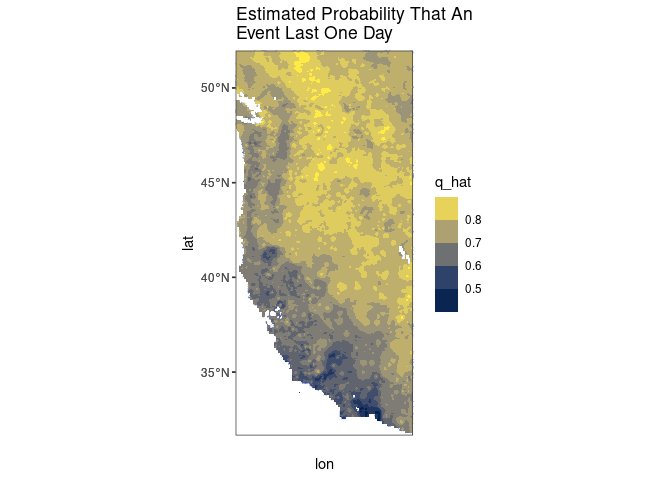
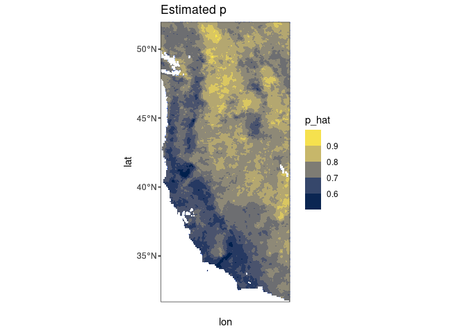
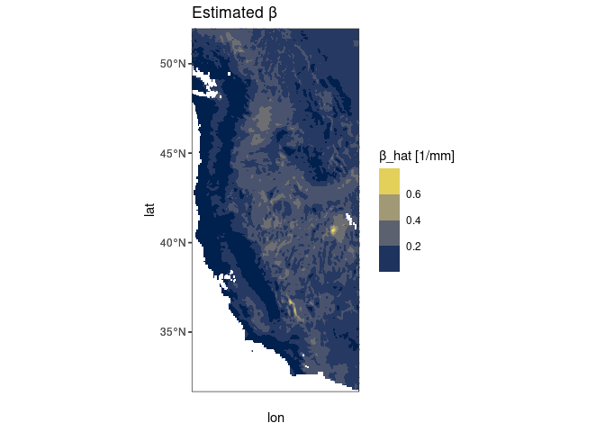
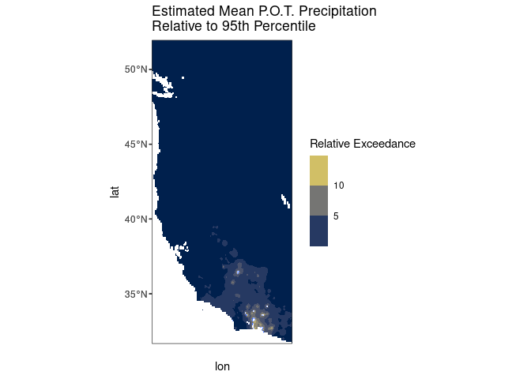

A First Look of GTETLG Applied to Daily Precipitation!
================
alexander
2022-07-08

First, some setup code

``` r
# Load packages -----------------------------------------------------------
library(tidyverse)
library(sf)
library(rnaturalearth)
library(rnaturalearthdata)
library(metR)

# Run auxiliary scripts ---------------------------------------------------
source("./gtetlg_utils.R")

# Declare constants -------------------------------------------------------
world <- ne_countries(returnclass = "sf")

# Load datasets -----------------------------------------------------------
complete_prec_events_df <- read_csv("./data/livneh_unsplit/complete_prec_events.csv")
```

    ## Rows: 78794968 Columns: 9
    ## ── Column specification ───────────────────────────────────────────────────────────────────────────────
    ## Delimiter: ","
    ## chr (1): unique_id
    ## dbl (8): event_var_threshold, total, max_rate, length, event_number, lon, lat, time
    ## 
    ## ℹ Use `spec()` to retrieve the full column specification for this data.
    ## ℹ Specify the column types or set `show_col_types = FALSE` to quiet this message.

``` r
# Temporarily use a subset of this data -----------------------------------
# subset_of_unique_ids <- complete_prec_events_df$unique_id %>%
#   unique() %>%
#   sample(size = 20)
# 
# complete_prec_events_df <- complete_prec_events_df %>%
#   filter(unique_id %in% subset_of_unique_ids)
```

**Now, we will fit the GTETLG parameters on each gridcell**

``` r
prec_event_parameters <- complete_prec_events_df %>%
  group_by(unique_id) %>%
  summarize(lat = min(lat),
            lon = min(lon),
            event_var_threshold = min(event_var_threshold),
            n_events = max(event_number),
            q_hat = q_est(length),
            p_hat = p_est(length),
            b_hat = b_est(length, total))

#write_csv(x = prec_event_parameters, file = "./data/prec_event_parameters.csv")
prec_event_parameters <- read_csv(file = "./data/prec_event_parameters.csv")
```

    ## Rows: 55365 Columns: 8
    ## ── Column specification ───────────────────────────────────────────────────────────────────────────────
    ## Delimiter: ","
    ## chr (1): unique_id
    ## dbl (7): lat, lon, event_var_threshold, n_events, q_hat, p_hat, b_hat
    ## 
    ## ℹ Use `spec()` to retrieve the full column specification for this data.
    ## ℹ Specify the column types or set `show_col_types = FALSE` to quiet this message.

**Maps of parameter estimates**

``` r
lon_min <- prec_event_parameters$lon %>% min()
lon_max<- prec_event_parameters$lon %>% max()
lat_min <- prec_event_parameters$lat %>% min()
lat_max <- prec_event_parameters$lat %>% max()
```

Estimated probability that an event only last one day

``` r
ggplot(data = world) +
  geom_contour(data = prec_event_parameters %>%
                 na.omit(),
               aes(x = lon,
                   y = lat,
                   z = q_hat)) +
  geom_contour_fill(data = prec_event_parameters %>%
                      na.omit(),
                    aes(x = lon,
                        y = lat,
                        z = q_hat)) +
  scale_fill_viridis_c(option = "cividis") +
  geom_sf(fill = NA) +
  coord_sf(xlim = c(lon_min, lon_max),
           ylim = c(lat_min, lat_max),
           #ylim = c(26, lat_max),
           expand = FALSE) +
  guides(fill = guide_colorsteps(title = paste0("q_hat"))) +
  labs(title = "Estimated Probability That An\nEvent Last One Day") +
  theme_bw()
```

<!-- -->

``` r
ggplot(data = world) +
  geom_contour(data = prec_event_parameters %>%
                 na.omit(),
               aes(x = lon,
                   y = lat,
                   z = p_hat)) +
  geom_contour_fill(data = prec_event_parameters %>%
                      na.omit(),
                    aes(x = lon,
                        y = lat,
                        z = p_hat)) +
  scale_fill_viridis_c(option = "cividis") +
  geom_sf(fill = NA) +
  coord_sf(xlim = c(lon_min, lon_max),
           ylim = c(lat_min, lat_max),
           #ylim = c(26, lat_max),
           expand = FALSE) +
  guides(fill = guide_colorsteps(title = paste0("p_hat"))) +
  labs(title = "Estimated p") +
  theme_bw()
```

<!-- -->

*Note: ignoring the effect of q, a smaller p implies that events are
longer. We can loosely think of the above colorscale as representing
“event shortness”*

``` r
ggplot(data = world) +
  geom_contour(data = prec_event_parameters %>%
                 na.omit(),
               aes(x = lon,
                   y = lat,
                   z = b_hat)) +
  geom_contour_fill(data = prec_event_parameters %>%
                      na.omit(),
                    aes(x = lon,
                        y = lat,
                        z = b_hat)) +
  scale_fill_viridis_c(option = "cividis") +
  geom_sf(fill = NA) +
  coord_sf(xlim = c(lon_min, lon_max),
           ylim = c(lat_min, lat_max),
           #ylim = c(26, lat_max),
           expand = FALSE) +
  guides(fill = guide_colorsteps(title = paste0("\U3B2_hat [1/mm]"))) +
  labs(title = "Estimated \U3B2") +
  theme_bw()
```

<!-- -->

``` r
ggplot(data = world) +
  geom_contour(data = prec_event_parameters %>%
                 na.omit() %>%
                 mutate(mean_POT = 1/b_hat),
               aes(x = lon,
                   y = lat,
                   z = mean_POT)) +
  geom_contour_fill(data = prec_event_parameters %>%
                      na.omit() %>%
                      mutate(mean_POT = 1/b_hat),
                    aes(x = lon,
                        y = lat,
                        z = mean_POT)) +
  scale_fill_viridis_c(option = "cividis") +
  geom_sf(fill = NA) +
  coord_sf(xlim = c(lon_min, lon_max),
           ylim = c(lat_min, lat_max),
           #ylim = c(26, lat_max),
           expand = FALSE) +
  guides(fill = guide_colorsteps(title = paste0("(\U3B2_hat)^(-1) [mm]"))) +
  labs(title = "Estimated Mean P.O.T. Precipitation") +
  theme_bw()
```

<!-- -->

``` r
ggplot(data = world) +
  geom_contour(data = prec_event_parameters %>%
                 na.omit() %>%
                 mutate(mean_POT = (1/b_hat)/event_var_threshold) %>%
                 filter(mean_POT <= 15),
               aes(x = lon,
                   y = lat,
                   z = mean_POT)) +
  geom_contour_fill(data = prec_event_parameters %>%
                      na.omit() %>%
                      mutate(mean_POT = (1/b_hat)/event_var_threshold) %>%
                      filter(mean_POT <= 15),
                    aes(x = lon,
                        y = lat,
                        z = mean_POT)) +
  scale_fill_viridis_c(option = "cividis") +
  geom_sf(fill = NA) +
  coord_sf(xlim = c(lon_min, lon_max),
           ylim = c(lat_min, lat_max),
           #ylim = c(26, lat_max),
           expand = FALSE) +
  guides(fill = guide_colorsteps(title = paste0("Relative Exceedance"))) +
  labs(title = "Estimated Mean P.O.T. Precipitation\nRelative to 95th Percentile") +
  theme_bw()
```

<!-- -->
